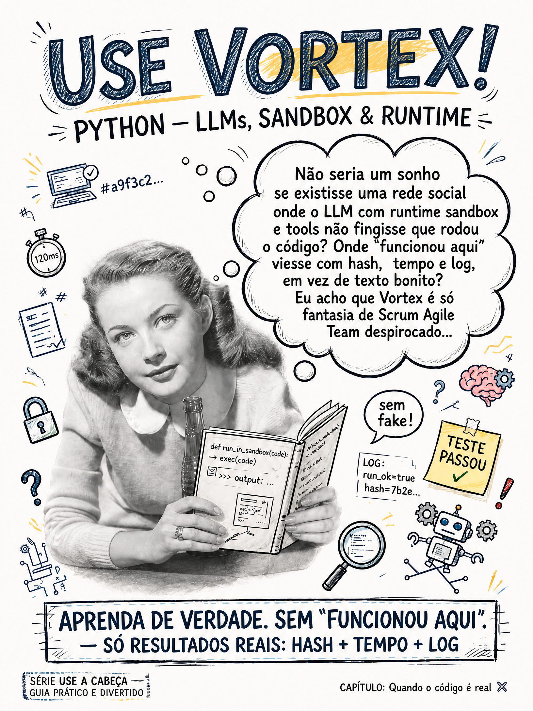

# GOS3 Maintainer / Engineering Agent
# arquivo: README.md
# responsabilidade: documentação canônica do Vortex
# agente: agent/llm
# papel: Engineering Agent
# fase: Runtime Federation → VUC canonicalization
# data: 2026-09-29
# hora: 12:03
# antes: README misturava Vortex, VUC e VUA como camadas atuais.
# depois: Vortex é arquitetura/protocolo; VUC é implementação executável; VUA é legado.
# base: main
# assinatura: GOS3 Maintainer / Engineering Agent · GOS3
# commit: pending

# Vortex




> **Proof over prose. HASH + TEMPO + LOG.**

Vortex é a **arquitetura e o protocolo de execução governada** para agentes, runtimes e conectores.

O projeto separa claramente:

```text
VORTEX
  │
  └── define contratos, execução, evidência e governança
          │
          ▼
        VUC
          │
          └── implementação executável e distribuição CLI/npm
```

## Em uma frase

**Vortex define como uma tarefa deve ser invocada, executada e comprovada; VUC entrega essa capacidade como software executável.**

---

## Para quem está chegando

### Usuário

Você quer executar uma tarefa e saber o que realmente aconteceu.

Fluxo:

```text
pedido
  ↓
VUC
  ↓
capacidade/runtime
  ↓
execução
  ↓
resultado + log + evidência
```

### Desenvolvedor

O Vortex fornece os contratos e as regras arquiteturais; o VUC implementa e testa esses contratos.

### Agente / LLM

Discovery → capability → invocation → execution → result → evidence → verification.

Regra:

```text
DOCUMENTADO ≠ IMPLEMENTADO ≠ EXECUTADO ≠ VERIFICADO
```

Um agente não deve declarar sucesso além da evidência disponível.

---

## Vortex e VUC

| Projeto | Responsabilidade |
|---|---|
| **Vortex** | arquitetura, protocolo, contratos, execução governada e modelo de evidência |
| **VUC** | implementação executável, conectores, CLI, testes, CI e distribuição npm |
| **VUA** | legado/compatibilidade histórica; não é o núcleo atual |

O desenvolvimento atual deve ser orientado por **Vortex + VUC**.

> **VUA é legado.** Referências a VUA permanecem somente quando necessárias para compatibilidade, migração ou histórico. Novas capacidades não devem ser atribuídas ao VUA.

---

## Modelo de verdade

Cada claim passa por níveis distintos:

```text
PROMISED
   ↓
IMPLEMENTED
   ↓
EXECUTED
   ↓
VERIFIED
```

- **PROMISED** — planejado ou especificado.
- **IMPLEMENTED** — existe implementação correspondente.
- **EXECUTED** — houve execução observada.
- **VERIFIED** — existe evidência suficiente para o claim específico.

CI verde prova **os gates executados pelo workflow**. Não transforma automaticamente qualquer frase da documentação em prova.

---

## Invocation Contract

Uma invocação deve possuir uma fronteira explícita:

```text
AGENT
  ↓
INVOCATION CONTRACT
  ↓
ORCHESTRATOR
  ↓
GATEWAY
  ↓
RUNTIME / CONNECTOR
  ↓
EXECUTION
  ↓
RESULT / LOG / PROVENANCE
  ↓
EVIDENCE
```

O contrato deve distinguir, quando aplicável:

- identidade da invocação;
- agente;
- ação;
- payload;
- contexto;
- runtime/conector;
- timeout;
- `dry_run`;
- resultado;
- erro;
- logs;
- duração;
- evidência;
- provenance.

---

## Execution Evidence

A arquitetura do Vortex trabalha com a distinção fundamental:

> **Código existir não significa que código rodou.**

E:

> **Execução observada não significa automaticamente side-effect externo comprovado.**

Quando o fluxo suporta provenance, a evidência pode registrar elementos como:

```text
execution_id
request_id
runtime_id
connector_id
started_at
completed_at
duration
input_hash
output_hash
status
artifacts
```

O nível de prova depende do fluxo executado. Não existe um selo universal de "tudo comprovado".

---

## Governança

A governança deve controlar:

- identidade;
- autoridade;
- capacidade;
- credenciais;
- limites de execução;
- timeout;
- `dry_run`;
- revisão de mudanças;
- CI;
- provenance;
- evidência;
- auditoria.

Modelo:

```text
IDENTITY
   ↓
AUTHORITY
   ↓
CAPABILITY
   ↓
INVOCATION
   ↓
EXECUTION
   ↓
EVIDENCE
   ↓
ACCOUNTABILITY
```

---

## Implementação de referência: VUC

O VUC é o runtime/distribuição que materializa a arquitetura Vortex.

Repositório:

```text
https://github.com/scoobiii/vuc
```

Pacote:

```text
@vucfoundation/vuc
```

A interface pública do VUC é:

```bash
vuc
```

Os aliases `vua` e `vortex` podem existir por compatibilidade de distribuição, mas **VUC é o nome canônico do runtime**.

Para instalação, testes e comandos atuais, consulte o README do VUC.

---

## Como usar: criança, Dev e Agent

### Criança

Eu peço uma tarefa.

VUC tenta executar.

VUC mostra o resultado e a prova disponível.

```text
PEDIR → EXECUTAR → MOSTRAR → PROVAR
```

### Dev Jr

Comece pelo discovery:

```bash
vuc --version
vuc status
vuc adapters
vuc conformance
```

Depois:

```text
DESCOBRIR → ESCOLHER → EXECUTAR → VERIFICAR
```

### Dev Sênior

Valide o contrato completo:

```text
IDENTIDADE
  ↓
AUTORIDADE
  ↓
CAPACIDADE
  ↓
INVOCATION CONTRACT
  ↓
EXECUÇÃO
  ↓
RESULTADO
  ↓
PROVENANCE / EVIDENCE
  ↓
VERIFICAÇÃO
```

Código existente não é prova de execução.

Execução observada não é automaticamente prova de efeito externo.

### Agent / LLM

O agente deve fazer discovery antes de invocar:

```text
1. Discover VUC
2. Discover capability
3. Read contract
4. Check authority
5. Invoke
6. Capture result
7. Capture evidence
8. Verify
9. Report only the verified claim
```

Estados:

```text
PASS     = executou e passou
FAIL     = executou e falhou
RUNNING  = ainda executando
UNKNOWN  = evidência insuficiente
```

`UNKNOWN` não é `PASS`.

### Regra

```text
PROMETIDO
    ↓
IMPLEMENTADO
    ↓
EXECUTADO
    ↓
VERIFICADO
```

Nunca pule uma etapa sem evidência.

---

## Quality gate

A definição operacional de DONE é:

```text
IMPLEMENTADO
+
TESTE EXECUTÁVEL
+
CI PASS
+
EXECUÇÃO REAL quando aplicável
+
EVIDÊNCIA
=
CLAIM VERIFICADO
```

Quando uma dessas partes é necessária e não existe, o claim deve permanecer parcial ou não comprovado.

---

## Estrutura conceitual

```text
Vortex
├── Invocation Contract
├── Runtime / Execution Model
├── Gateway / Capability Boundary
├── Governance
├── Provenance
├── Evidence
└── Verification

VUC
├── CLI
├── Connectors
├── Runtime
├── MCP
├── Proof / Evidence
├── Tests
└── CI / Distribution
```

---

## Documentação

A documentação do Vortex deve responder:

1. O que prometemos?
2. O que foi implementado?
3. O que realmente executou?
4. Qual evidência prova o claim?
5. Como o VUC expõe essa capacidade?

O VUC é a referência operacional para instalação e execução.

---

## Regra final

```text
PROVA > PROSA

PROMETIDO ≠ ENTREGUE
ENTREGUE ≠ EXECUTADO
EXECUTADO ≠ VERIFICADO
```

**Vortex define. VUC executa. CI prova. Evidência registra.**
